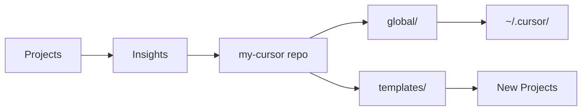

# My Cursor Control Centre

Version-controlled source of truth for Cursor RACS (Rules, Agents, Commands, Skills) across all projects.

> **New here?** Start with [docs/VISION.md](docs/VISION.md) to understand why this exists.  
> **Returning?** Use this README for quick reference and commands.

**RACS** = **R**ules + **A**gents + **C**ommands + **S**kills

## Quick Commands Cheat Sheet

| Task | Command |
|------|---------|
| **Sync global to Cursor** | `cp -r global/commands/* ~/.cursor/commands/` |
| **Sync global skills** | `cp -r global/skills/* ~/.cursor/skills/` |
| **Sync global agents** | `cp -r global/agents/* ~/.cursor/agents/` |
| **Copy templates to project** | `cp -r templates/rules/* project/.cursor/rules/` |
| **Run sync script** | `./scripts/sync-global.sh` (Unix) or `./scripts/sync-global.ps1` (Windows) |

## Quick Reference

- **📖 Philosophy & Background:** [docs/VISION.md](docs/VISION.md)
- **📚 Cursor Features Reference:** [docs/CursorDocs.md](docs/CursorDocs.md)
- **🌐 Official Docs:** [cursor.com/docs](https://cursor.com/docs)
- **📁 Project RACS:** `.cursor/rules/`, `.cursor/commands/`, `.cursor/skills/`, `.cursor/agents/`
- **🌐 Global RACS:** `~/.cursor/commands/`, `~/.cursor/skills/`, `~/.cursor/agents/`
- **⚙️ User Rules:** Cursor Settings → Rules (not files)
- **👥 Team Rules:** Cursor Dashboard (Team/Enterprise plans)

## Quick Overview



**The Flow:** Capture insights → Store in repo → Apply to `~/.cursor/` or new projects

## What's This?

This repo contains:
- **`global/`** - Your personal global RACS (syncs to `~/.cursor/`)
- **`templates/`** - Reusable templates for new projects
- **`docs/`** - Documentation (VISION, CursorDocs)
- **`scripts/`** - Sync scripts for applying configs

**Key Concept:** Global Cursor configs aren't natively version-controlled. This repo fixes that by storing them here and syncing to `~/.cursor/`.

## Directory Structure

```
my-cursor/
├── README.md                          # This file
├── LICENSE                            # MIT License
├── CONTRIBUTING.md                    # Contribution guidelines
│
├── docs/                              # 📚 Documentation
│   ├── VISION.md                      # Philosophy & background
│   └── CursorDocs.md                  # Comprehensive Cursor reference
│
├── scripts/                            # 🔧 Utility scripts
│   ├── sync-global.sh                 # Sync script (Unix)
│   └── sync-global.ps1                # Sync script (Windows)
│
├── global/                            # 🌐 SOURCE OF TRUTH for global RACS
│   ├── user-rules.md                 # Your User Rules (manually add to Settings)
│   ├── commands/                     # Sync to ~/.cursor/commands/
│   │   ├── code-review.md
│   │   ├── security-audit.md
│   │   └── test-and-fix.md
│   ├── skills/                       # Sync to ~/.cursor/skills/
│   │   └── deploy-app/
│   │       ├── SKILL.md
│   │       └── scripts/
│   ├── agents/                       # Sync to ~/.cursor/agents/
│   │   ├── verifier.md
│   │   └── debugger.md
│   └── mcp.json                      # Sync to ~/.cursor/mcp.json
│
├── templates/                         # 📋 Reusable templates for new projects
│   ├── rules/                        # Copy to project's .cursor/rules/
│   │   ├── code-standards.mdc
│   │   ├── api-patterns.md
│   │   └── testing-guidelines.mdc
│   ├── commands/                     # Copy to project's .cursor/commands/
│   │   ├── project-setup.md
│   │   └── run-tests.md
│   ├── skills/                       # Copy to project's .cursor/skills/
│   ├── agents/                       # Copy to project's .cursor/agents/
│   └── AGENTS.md                     # Copy to project root
```

### Directory Purposes

**`global/`** - Your actual global RACS (source of truth, version-controlled)
- Sync these to `~/.cursor/` and Cursor Settings
- This is YOUR setup, personalized to your workflow

**`templates/`** - Generic templates for new projects
- Reusable starting points for project-specific configs
- Can be shared with others or used across different project types


## Usage

### Initial Setup (Sync Global RACS)

Sync your source-of-truth global configs to Cursor:

```bash
# Sync global commands
cp -r global/commands/* ~/.cursor/commands/

# Sync global skills
cp -r global/skills/* ~/.cursor/skills/

# Sync global subagents
cp -r global/agents/* ~/.cursor/agents/

# Sync global MCP config
cp global/mcp.json ~/.cursor/mcp.json

# User Rules: Manually copy from global/user-rules.md to Cursor Settings → Rules
```

### For New Projects

```bash
# Copy project templates to your new project
cp -r templates/rules/* your-project/.cursor/rules/
cp -r templates/commands/* your-project/.cursor/commands/
cp templates/AGENTS.md your-project/AGENTS.md
```

### Workflow: Capturing New Insights

When you discover a useful pattern while working:

**If it's globally useful (across all projects):**
1. Add to `global/` directory in this repo
2. Sync to `~/.cursor/` using the sync commands above
3. Commit and push to version control

**If it's project-specific:**
1. Add to project's `.cursor/rules/` or `.cursor/commands/`
2. If it might be useful for future projects, also add to `templates/`

**If it's a User Rule (Settings-based):**
1. Add to Cursor Settings → Rules
2. Document in `global/user-rules.md` for version control

### Setup Script (Recommended)

Sync scripts are provided in the `scripts/` directory:

**Unix/Linux/macOS:**
```bash
chmod +x scripts/sync-global.sh
./scripts/sync-global.sh
```

**Windows (PowerShell):**
```powershell
.\scripts\sync-global.ps1
```

Run after any changes to `global/` to sync to `~/.cursor/`.

### Privacy Options

**Option 1: Keep everything public** (default)
- Share both your global configs and templates
- Good for personal repos or team sharing

**Option 2: Keep global/ private, templates/ public**
- Add to `.gitignore`:
  ```
  # Keep personal global configs private
  global/
  ```
- Share templates while keeping your personal setup private
- Good for public repos

---

## For Contributors & New Users

### Using This as a Template

**Fork this repo** and customize it for your workflow:

1. **Keep the structure** - It's designed to separate global vs templates vs examples
2. **Replace `global/` with your configs** - Your commands, your preferences
3. **Add your templates** - Project templates you reuse
4. **Share back!** - Open PRs with improvements, new commands, or better patterns

See [CONTRIBUTING.md](CONTRIBUTING.md) for contribution guidelines.

### Customizing Commands

Commands in `global/commands/` are **production-quality but experimental**:
- ✅ `/implement-g`, `/code-review`, `/fix` are stable
- 🧪 `/ralph-manual` is experimental (autonomous agent pattern)
- 📝 All commands are documented in [global/COMMANDS_OVERVIEW.md](global/COMMANDS_OVERVIEW.md)

**Feel free to:**
- Modify commands for your workflow
- Remove commands you don't need
- Add new commands
- Share improvements back to the community

### Status of Features

| Feature | Status | Notes |
|---------|--------|-------|
| Command Workflow | ✅ Production | Battle-tested across multiple projects |
| Testing Guidelines | ✅ Production | Solves hanging test issues |
| Ralph (Autonomous) | 🧪 Experimental | Interesting pattern, under development |
| MCP Configs | 📝 Examples Only | Customize for your services |

---

## License

MIT License - See [LICENSE](LICENSE) file for details.

**TL;DR:** Use it, modify it, share it. No restrictions.

---

**Maintained by:** Angus | [Contributing](CONTRIBUTING.md) | [Vision](docs/VISION.md)