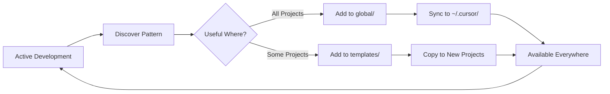

# Vision: My Cursor Control Centre

## The Problem

Cursor has a confusing array of configuration layers:
- User rules, project rules, team rules
- User commands, project commands
- Agent.md files
- Skills, Subagents, MCP servers
- Custom workflows (like my MAD experiments)

**Without a system, you lose insights.** You solve the same problem twice. You can't remember which rules work. You can't version control global configs. You can't share knowledge across projects.

## The Solution

This repo provides a **single source of truth** for capturing and reusing development insights across all projects.

**Core Insight:** Cursor configurations are knowledge artifacts. They should be:
- ✅ Version-controlled (backup, history, portability)
- ✅ Organized (easy to find and reuse)
- ✅ Composable (mix and match for different projects)
- ✅ Shareable (team collaboration optional)

## RACS Philosophy

> **RACS** = **R**ules + **A**gents (subagents) + **C**ommands + **S**kills

These four configuration types cover the major ways to extend Cursor:

**Rules** - Define standards and conventions
- Project-specific patterns
- Team coding standards
- Personal preferences

**Agents (Subagents)** - Handle complex, isolated tasks
- Independent context windows
- Specialized expertise
- Parallel execution

**Commands** - Trigger repeatable workflows
- Human-in-the-loop processes
- Standardized procedures
- Quick automation

**Skills** - Provide executable, portable capabilities
- Domain-specific knowledge
- Runnable scripts
- Progressive resource loading

Together, these form a comprehensive system for:
- Extending Cursor's capabilities
- Capturing development knowledge
- Compounding learning over time

## Key Benefits

### 🔐 Version Control for Global Configs
Global Cursor configs live in `~/.cursor/` and aren't natively version-controlled. This repo changes that by storing your global RACS here and syncing them.

**Benefits:**
- Backup (never lose your setup)
- History (see what changed and why)
- Portability (clone on new machine, instant setup)

### 🚀 Fast Project Setup
Templates provide instant, consistent configuration for new projects. No more copying configs manually or reinventing patterns.

### 🧠 Knowledge Capture That Compounds
Every insight feeds back into this repo. Over time, you build:
- Personal best practices
- Battle-tested patterns
- Reusable workflows
- Team standards (optional)

### 💻 Multi-Machine Sync
One repo, many machines. Clone this repo, run the sync script, and you're ready to develop.

### 🤝 Team Sharing (Optional)
Share templates with your team while keeping personal configs private. Or share everything. Your choice.

## The Flow

**Continuous improvement:**
1. Work on projects
2. Notice patterns (what works, what's repeated)
3. Capture in this repo (global or templates)
4. Apply to future work
5. Refine based on experience

This creates a **compound learning effect** where each project makes the next one easier.

## Background: My Development Approach

### Multi-Tool Strategy

I use various AI tools to benefit from model variety and generous free tiers:

**For Development:**
- Anthropic's Claude (Cursor)
- Google Antigravity
- Amazon Kiro
- OpenAI Codex

**For Prototyping:**
- Loveable
- Figma
- Make

The best outcomes come from using the right tool for the job, at the cost of some complexity.

### MAD Workflows (Experimental)

As of January 25th, 2026, I'm experimenting with **MAD (Multi-Agent Debate)** workflows.

**The Concept:** Use LangGraph to coordinate agent debates. Multiple calls to low-cost frontier models can produce better outputs than one-shot high-cost reasoning models.

**Current State:**
- ✅ Great for documentation and research
- ⚠️ Limited for code execution (needs better MCP/tool/skill integration)
- 🔄 Meanwhile, my Cursor commands provide structured, human-in-the-loop workflows that execute well on code

## Why This Repo Exists

I kept solving the same problems. I kept writing the same rules. I couldn't remember what worked. I lost configs when switching machines.

This repo is the answer: **A living knowledge base that grows with development experience.**

It's not just about storing configs. It's about:
- Building a personal AI development system
- Capturing what works
- Compounding knowledge over time
- Making each project easier than the last

---

**See [README.md](README.md) for practical usage and setup instructions.**
