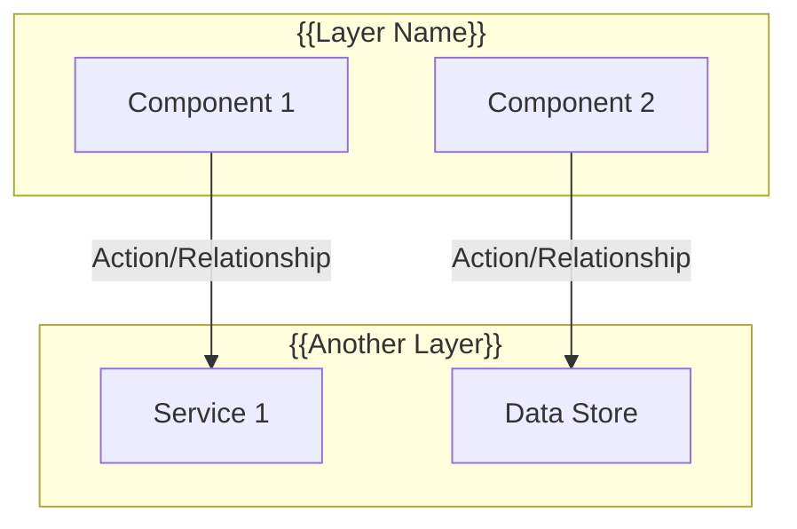

# gen-design

Write your command content here.

This command will be available in chat with /gen-design

# Design Document Template Generator

This template provides a standardized structure for creating comprehensive design documents. Use this as a guide when generating new design documents for features, systems, or components.

## Usage

When creating a new design document, replace all placeholders (marked with `{{PLACEHOLDER}}`) with specific information for your feature. Follow the structure and style of the examples in `docs/styling/design.md` and `docs/slideVariantMgmt/design.md`.

---

# Design Document: {{FEATURE_NAME}}

## Overview

{{Provide a 2-3 paragraph overview that:}}
- *Specifies what system/feature this design document covers*
- *Describes the main capabilities and goals*
- *Explains the architectural approach and key technologies*
- *Mentions any backward compatibility considerations or design priorities*

## Architecture

{{Create a mermaid flowchart diagram showing:}}
- *System components and their relationships*
- *Data flow between components*
- *External dependencies (databases, APIs, services)*
- *State management layers*
- *User interaction points*



## Components and Interfaces

### Frontend Components

| Component | File | Purpose |
|-----------|------|---------|
| `{{ComponentName}}` | `{{file/path.tsx}}` | {{Brief description of purpose}} |

**Note**: Replace placeholders with actual component names and file paths (e.g., `MyComponent` and `src/components/MyComponent.tsx`). Use paths relative to the project root.

### {{Component/Service}} Interface

```typescript
interface {{InterfaceName}} {
  {{property}}: {{type}};
  {{method}}(): {{returnType}};
}

// Hook/Function
export function {{hookOrFunction}}(): {{ReturnType}};

// Provider/Component
export function {{ProviderOrComponent}}({ children }: { children: ReactNode }): JSX.Element;
```

**State Management**:
- {{Describe initialization logic}}
- {{Describe persistence mechanism}}
- {{Describe fallback behavior}}
- {{Describe side effects (analytics, etc.)}}

### {{Additional Interfaces}}

{{Repeat interface sections as needed for different components/services}}

### Analytics Interface (if applicable)

```typescript
// Updated EventType to include new event types
export type EventType =
  | "{{existing_event}}"
  | "{{new_event_1}}"        // NEW
  | "{{new_event_2}}";        // NEW

// Event tracking function
export async function track{{EventName}}(
  sessionId: string,
  {{additionalParams}}?: {{type}}
): Promise<void> {
  return trackEvent({
    event: '{{event_type}}',
    sessionId,
    payload: { {{payload_fields}} },
  });
}
```

## Data Models

### {{Table/Collection Name}} ({{schema}}.{{table}})

| Column | Type | Description |
|--------|------|-------------|
| id | {{type}} | Primary key |
| {{column}} | {{type}} | {{Description}} |
| {{column}} | {{type}} | {{Description}} |

**Table Structure**:
```sql
create table if not exists {{schema}}.{{table}} (
  id {{type}} primary key default {{default_value}},
  {{column}} {{type}} not null {{constraints}},
  {{column}} {{type}} {{constraints}},
  {{foreign_key_constraints}},
  {{check_constraints}}
);
```

**RLS Policies** (if applicable):
- {{Describe access policies}}
- {{Describe role-based permissions}}

**Audit Logging** (if applicable):
{{Describe audit logging approach, fields, and implementation}}

### {{Additional Tables/Collections}}

{{Repeat data model sections as needed}}

### {{State/Flow Diagram}} (if applicable)

```mermaid
stateDiagram-v2
    [*] --> {{InitialState}}
    
    {{InitialState}} --> {{NextState}}: {{Condition}}
    {{NextState}} --> {{FinalState}}: {{Condition}}
    
    {{FinalState}} --> [*]
```

## Implementation Details

### Database Migrations

**Migration 1: {{Migration Name}}**
- Location: `{{path/to/migration.sql}}` (use actual path, e.g., `supabase/migrations/20240101000000_create_table.sql`)
- {{Describes what the migration does}}
- {{Lists tables/columns/enums created or modified}} (use actual table/column/enum names)

**Migration 2: {{Migration Name}}**
- Location: `{{path/to/migration.sql}}` (use actual path)
- {{Describes what the migration does}}

### {{Implementation Section Name}}

{{Provide detailed implementation guidance for:}}
- *Configuration files* (include actual file paths, e.g., `vite.config.ts`, `tailwind.config.ts`)
- *CSS/styling changes* (include actual CSS variable names, class names, file paths)
- *Component integration* (include actual component names and file paths where components are used)
- *State management setup* (include actual hook/function names and file paths)
- *API integration* (include actual endpoint URLs, function names, file paths)
- *Any other technical implementation details*

**Example Implementation**:
```{{language}}
{{code example showing key implementation pattern}}
```

**Note**: Use concrete file paths and names (not placeholders) so `/gen-tasks` can generate actionable tasks.

### {{Additional Implementation Sections}}

{{Add sections for:}}
- *CSS Variable System (if styling-related)*
- *Component Integration*
- *State Initialization Flow*
- *Performance Requirements*
- *Accessibility Implementation*
- *Any other relevant implementation details*

## Correctness Properties

*A property is a characteristic or behavior that should hold true across all valid executions of a system—essentially, a formal statement about what the system should do.*

### Property 1: {{Property Name}}

*For any* {{condition}}, the {{System_Name}} SHALL {{expected_behavior}}.

**Validates: Requirements {{X.Y}}, {{X.Z}}**

### Property 2: {{Property Name}}

*For any* {{condition}}, the {{System_Name}} SHALL {{expected_behavior}}.

**Validates: Requirements {{X.Y}}**

{{Continue with additional properties as needed. Each property should:}}
- *Be stated in formal language ("For any X, the system SHALL Y")*
- *Reference specific requirements it validates*
- *Be testable and verifiable*

## Error Handling

### {{Error Category}} Errors

| Error Scenario | User-Facing Behavior | Recovery Action |
|----------------|---------------------|-----------------|
| {{Error condition}} | {{What user sees}} | {{How system recovers}} |
| {{Error condition}} | {{What user sees}} | {{How system recovers}} |

### {{Additional Error Categories}}

{{Repeat error handling tables for different error categories:}}
- *Initialization Errors*
- *Validation Errors*
- *Network/API Errors*
- *Database Errors*
- *State Management Errors*

## Testing Strategy

### Unit Testing

Unit tests will cover specific examples and edge cases:

1. **{{Component/Feature}} Tests**
   - {{Test case description}}
   - {{Test case description}}
   - {{Test case description}}

2. **{{Component/Feature}} Tests**
   - {{Test case description}}
   - {{Test case description}}

{{Continue listing test categories as needed}}

### Property-Based Testing

Property-based tests will use **fast-check** library to verify universal properties across many inputs.

Each property test will:
- Run a minimum of 100 iterations
- Be tagged with the format: `**Feature: {{feature-name}}, Property {number}: {property_text}**`
- Reference the specific correctness property from this design document

**Property Tests to Implement**:

1. **Property 1 Test**: {{Description of what the test verifies}}
   - **Property 1: {{Property Name}}** (from Correctness Properties section above)
   - **Validates: Requirements {{X.Y}}, {{X.Z}}** (must match the "Validates" line from Property 1)
2. **Property 2 Test**: {{Description of what the test verifies}}
   - **Property 2: {{Property Name}}** (from Correctness Properties section above)
   - **Validates: Requirements {{X.Y}}** (must match the "Validates" line from Property 2)
3. **Property 3 Test**: {{Description of what the test verifies}}
   - **Property 3: {{Property Name}}** (from Correctness Properties section above)
   - **Validates: Requirements {{X.Y}}, {{X.Z}}** (must match the "Validates" line from Property 3)

{{Continue listing property tests, one for each correctness property. Each property test must:}}
- *Reference the property number and name from the Correctness Properties section*
- *Include the exact same "Validates: Requirements X.Y, X.Z" line from the corresponding property*

### Test File Organization

```
{{project_structure}}/
├── {{component_path}}/
│   └── __tests__/
│       ├── {{Component}}.test.tsx          # Unit tests
│       └── {{Component}}.property.tsx      # Property tests
├── {{lib_path}}/
│   └── __tests__/
│       ├── {{utility}}.test.ts             # Unit tests
│       └── {{utility}}.property.ts        # Property tests
```

---

## Template Notes

### When to Use This Template

- Creating a new feature that requires multiple components
- Designing a system that spans frontend and backend
- Documenting a feature that requires database changes
- Specifying behavior that needs formal correctness properties
- Features that require comprehensive testing strategies

### Sections to Customize

1. **Architecture Diagram**: Adapt the mermaid diagram to your specific system architecture
2. **Data Models**: Include all relevant database tables, schemas, and relationships
3. **Correctness Properties**: Define formal properties that can be verified through testing
4. **Implementation Details**: Provide concrete code examples and file paths
5. **Testing Strategy**: Specify both unit tests and property-based tests

### Sections to Remove if Not Applicable

- **Analytics Interface**: Remove if feature doesn't involve analytics
- **Database Migrations**: Remove if no database changes needed
- **RLS Policies**: Remove if not using Supabase or similar
- **Property-Based Testing**: Remove if not using fast-check or similar libraries

### Style Guidelines

- Use formal language for correctness properties ("SHALL", "MUST", "SHOULD")
- Include code examples in appropriate languages (TypeScript, SQL, CSS, etc.)
- Use mermaid diagrams for visual representation of architecture and flows
- Reference specific requirements by number when validating properties
- Provide concrete file paths and examples
- Include both positive and negative test cases

### Formatting for `/gen-tasks` Compatibility

To ensure this design document works well with the `/gen-tasks` command:

1. **Requirement References**: Always use the exact format `**Validates: Requirements X.Y, X.Z**` in Correctness Properties. Use comma-separated requirement numbers (e.g., "1.1, 1.2, 2.3").

2. **Property Test Mapping**: In the Testing Strategy section, each property test must:
   - Reference the property number (e.g., "Property 1", "Property 2")
   - Include the property name from the Correctness Properties section
   - Include the exact same "Validates: Requirements X.Y, X.Z" line from the corresponding property

3. **Concrete Details**: Replace all placeholders with actual values:
   - Use real file paths (e.g., `src/components/MyComponent.tsx` not `{{file/path.tsx}}`)
   - Use actual component/function names
   - Use actual table/column names for database schemas
   - Use actual requirement numbers from the requirements document

4. **Component Tables**: Ensure the Frontend Components table includes:
   - Actual component names (not placeholders)
   - Actual file paths relative to project root
   - Clear purpose descriptions

5. **Interface Definitions**: Provide complete TypeScript interfaces with:
   - All required properties and their types
   - Method signatures with return types
   - No placeholder types (use actual types like `string`, `number`, `User`, etc.)

